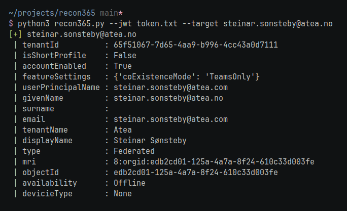
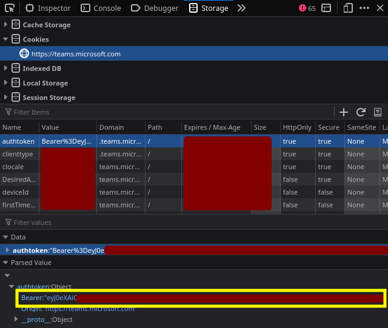

<h1 align="center">recon365</h1>
<p align="center">
Gather information from an email address connected to AzureAD or Office 365
</p>
<p align="center">
<a href="#example-outputs">Example outputs</a> •
<a href="#how-to-find-your-jwt-token">How to find your JWT token</a> •
<a href="#usage">Usage</a> •
<a href="#references">References</a>

</p>

## Example outputs
### Get info on on an email address in Azure AD
```console
$ python3 recon365.py --jwt token.txt --target steinar.sonsteby@atea.no
[+] steinar.sonsteby@atea.no
 | tenantId          : 65f51067-7d65-4aa9-b996-4cc43a0d7111
 | isShortProfile    : False
 | accountEnabled    : True
 | featureSettings   : {'coExistenceMode': 'TeamsOnly'}
 | userPrincipalName : steinar.sonsteby@atea.com
 | givenName         : steinar.sonsteby@atea.no
 | surname           :
 | email             : steinar.sonsteby@atea.com
 | tenantName        : Atea
 | displayName       : Steinar Sønsteby
 | type              : Federated
 | mri               : 8:orgid:edb2cd01-125a-4a7a-8f24-610c33d003fe
 | objectId          : edb2cd01-125a-4a7a-8f24-610c33d003fe
 | availability      : Offline
 | devicieType       : Mobile
```

### User with an Microsfot 356 account

```console
$ python3 recon365.py --jwt token.txt -t info@nrk.no
[+] info@nrk.no
 | skypeId           : karina-4a
 | city              : bergen
 | state             : bergen komune
 | country           : Norway
 | avatarUrl         : https://api.skype.com/users/karina-4a/profile/avatar
 | isShortProfile    : False
 | accountEnabled    : True
 | userPrincipalName : info@nrk.no
 | email             : info@nrk.no
 | displayName       : karina grøneng
 | type              : SkypeConsumer
 | mri               : 8:karina-4a
 | availability      : PresenceUnknown
 | devicieType       : None
```

### Get info on a domain
```console
$ python3 recon365.py --token teams_jwt_token.txt --target coop.no
[+] nrk.no
 | State                   : 3
 | UserState               : 2
 | Login                   : nrk.no
 | NameSpaceType           : Federated
 | DomainName              : nrk.no
 | FederationGlobalVersion : -1
 | AuthURL                 : https://sts.nrk.no/adfs/ls/?username=nrk.no&wa=wsignin1.0&wtrealm=urn%3afederation%3aMicrosoftOnline&wctx=
 | FederationBrandName     : NRK
 | CloudInstanceName       : microsoftonline.com
 | CloudInstanceIssuerUri  : urn:federation:MicrosoftOnline
```

### A regular Office 365 user
Note: currently the script checks if the user has skype and then show the output according to the fetched data. I havent had the opportunity to test on a user who has not created a Skype account. So this needs a more thorough testing

```console
$ python3 recon365.py -t token.txt -e joe@gmail.com
Full Name       Joe Smith 
Email Address   joe@gmail.com
Skype ID        live:joe.smith
User Type       SkypeConsumer
```

## How to find your JWT token
Visit https://teams.microsoft.com and fetch the JWT token from the Storage. Be aware that this token may expire after around 24 hours



## Usage
```console
$ python3 recon365.py --help
usage: recon365.py [options]

options:
  -h, --help            show this help message and exit
  -j PATH, --jwt PATH   Path to file containing your Microsoft Teams JWT token
  -t TARGET, --target TARGET
                        Email address or domain you'd like to fetch information for
  -l FILE, --list FILE  File containing email addresses or domains you'd like to fethc information for
```

## References
- https://github.com/nyxgeek/o365recon
- https://badoption.eu/blog/2023/02/06/spoof_office_comments.html
- https://github.com/Gerenios/AADInternals
